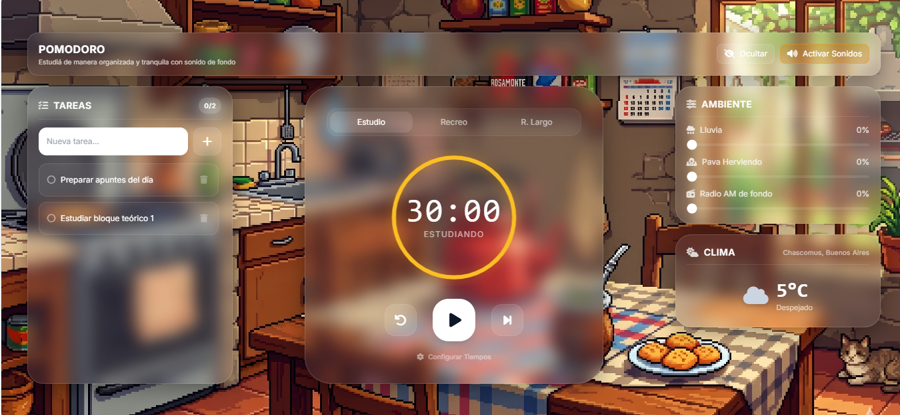

# ⏱️ Pomodoro Argentino Estudio (Pomodoro Matero)

Un temporizador Pomodoro minimalista y funcional enfocado en el estudio sin distracciones. Combina un diseño moderno con la técnica de **Glassmorphism (Efecto Espejo/Cristal)** sobre una ilustración acogedora de una cocina rústica argentina en estilo *pixel art*. 

El proyecto integra una lista de tareas dinámica, un sintetizador de audio ambiental en tiempo real y un widget que consulta el estado meteorológico actual sin salir de la pestaña.



---

## ✨ Características Principales

- **Diseño Glassmorphic Atractivo:** Interfaz moderna con paneles translúcidos y desenfoque de fondo (`backdrop-filter`) que garantizan legibilidad óptima y contraste sobre el fondo de pantalla pixelado.
- **Modo Zen Adaptativo:** Permite ocultar temporalmente los paneles laterales de tareas y sonido ambiental con un solo clic, centrando toda la atención visual en el temporizador circular.
- **Sintetizador de Audio de Ambiente (Web Audio API):** Genera paisajes sonoros de fondo (lluvia, una pava hirviendo para el mate, o el zumbido de una radio AM vieja) directamente de forma matemática mediante código, **sin necesidad de descargar o cargar archivos pesados de audio estático (.mp3 o .wav)**.
- **Lista de Tareas (To-Do List) Integrada:** Permite añadir, marcar como completadas o eliminar subtareas o apuntes de estudio diarios con persistencia local.
- **Widget de Clima Automatizado:** Consulta y renderiza en tiempo real la temperatura local, la descripción del clima y la ubicación exacta del usuario mediante la API de `wttr.in`.
- **Configuración a Medida:** Los tiempos de los bloques pueden reajustarse desde la interfaz para adaptarse a distintas variantes de la técnica (ej: bloques de estudio de 30 min, recreos cortos de 5 min y recreos largos de 15 min).
- **Persistencia de Datos:** El progreso de minutos de foco, la configuración del reloj y el listado de tareas pendientes se guardan automáticamente en el navegador (`LocalStorage`).

---

## 🚀 Tecnologías y Herramientas Utilizadas
- **HTML5 Semántico:** Estructuración y empaquetado seguro de los elementos del espacio de trabajo.

- **Tailwind CSS (v3):** Framework utilitario de CSS para la maquetación veloz de componentes y adaptabilidad responsiva en pantallas móviles y de escritorio.

- **Vanilla JavaScript (ES6):** Toda la lógica modular encapsulada en una función de invocación inmediata (IIFE) para evitar colisiones en el alcance (scope) global.

- **Web Audio API:** Generación avanzada de ondas de sonido digitales (marrón, rosa y blanco) y osciladores integrados para crear los bucles ambientales y las alertas de notificación.

- **Fetch API:** Consumo asíncrono del servicio meteorológico para actualizar dinámicamente el HUD del clima en base a la IP del usuario.

- **LocalStorage API:** Mecanismo nativo para la retención y recuperación de estados de la aplicación entre sesiones de navegación.

- **FontAwesome & Google Fonts:** Tipografía de lectura clara (Inter) y soporte iconográfico vectorizado.

---

## 💻 Ejecución y Uso Local
Al ser un desarrollo frontend sin dependencias externas ni servidores backend en Node.js o Python, poner en marcha la aplicación es inmediato:

1. Descarga o clona el repositorio:
git clone [https://github.com/tu-usuario/pomodoro-argentino-estudio.git](https://github.com/tu-usuario/pomodoro-argentino-estudio.git)
2. Accede al directorio del proyecto e inicia el entorno abriendo el archivo pomodoro_argentino.html en tu navegador predeterminado.
3. (Opcional pero recomendado): Utiliza una extensión de servidor web local como Live Server en Visual Studio Code para habilitar de manera correcta el almacenamiento local e interactuar fluidamente con la API del clima sin bloqueos de origen local.

---

## 🛠️ Arquitectura y Estructura de Archivos

La estructura del repositorio se distribuye de manera limpia y modular:

```text
pomodoro-argentino-estudio/
├── pomodoro_argentino.html    # Estructura HTML5 de la aplicación y maquetación con Tailwind CSS.
├── README.md                  # Documentación del proyecto.
├── css/
│   └── style.css              # Estilos personalizados para efectos de cristal, barras de progreso y tipografías.
├── images/
│   └── wallpaper-pomodoro.png # Fondo de pantalla principal (Ilustración de cocina pixel art).
└── js/
    └── app.js                 # Lógica de estados del reloj, gestión de tareas, llamadas a API y motor Web Audio API.
